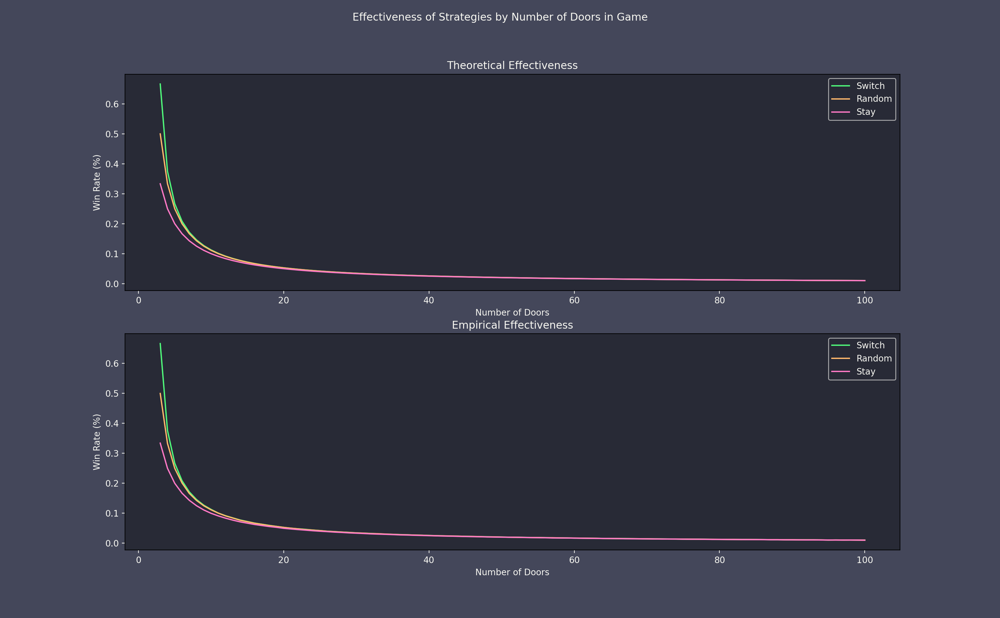

## Monty Hall Exploration

This repository houses code that is used to experiment with the [Monty Hall Problem](https://en.wikipedia.org/wiki/Monty_Hall_problem).

The Monty Hall Game is played according to the following sequence:
- There is a host (Monty Hall) and a contestant
- There are 3 doors on stage. Two of the doors contain a non-prize (e.g. a goat) and the remaining door contains a 
prize (e.g. a car).
- The contestant selects one of the 3 doors.
- The host then reveals what is behind one of the two unselected doors. The host will always reveal a goat. If there
are only goats behind the unselected door (i.e. the contestant selected the car on the initial selection), the host
will randomly choose one of the doors to reveal.
- The contestant then has the opportunity to either stay with their current door, or switch to the other unrevealed door.
- Once the selection is made, the contestant receives whatever is behind their selected door.

The Monty Hall Problem deals with this game, and asks, what is the best strategy to employ after the door is revealed?
Most people's intuition, including my own, leads me to believe that it doesn't matter what door you pick - you have a 
50-50 chance no matter what you do. But is that true?

This includes Java code to test three different strategies when playing the Monty Hall Game:
1. Random - the random strategy will randomly select one of the available doors with a uniform distribution.

2. Stay - the stay strategy will always elect to stay with the original door.

3. Switch - the switch strategy will randomly select one of the available doors excluding the currently selected door
with a uniform distribution.

The strategy is configurable from within the code and so is the number of doors in the game.

As it turns out, it does matter what you do. The Stay strategy is always the worst strategy you can choose and the Switch
is always the best. What follows is the effectiveness of each strategy where `n` is the number of doors in the game
(which is typically 3).

- Random: `1 / (n-1)`
- Stay: `1 / n`
- Switch: `(n-1) / (n*(n-2))`
